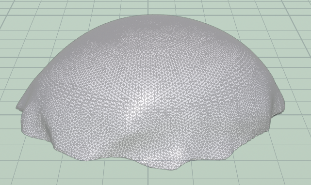

# Procedural Jellyfish

## Bell and Arms

## Veins

## Tentacles

## Extra Credit

I add extra puckering to the edge of the bell, and add a little details on the tentacles which make tentacle connect to the actual part of the jellyfish.

Also I render the video using principled shader. It takes me a whole day to render since my computer is underperformance.

One problem I encountered is that the joint place that connect with tentacles is wierd. I use glue to stick two poly lines. But it cannot glue exactly two points, but also glue neighboring points, which make it looks really bad at the joint.